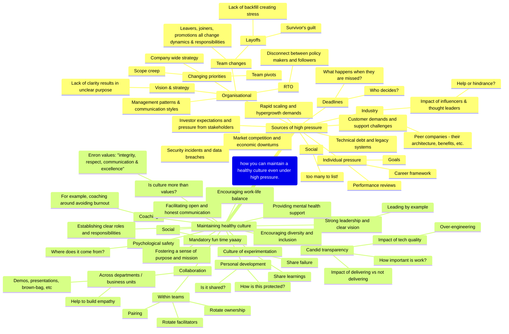

Scribbling notes prior to Lead Dev 2024

# Questions

- Think of a time when your team was under an unusually high amount of pressure? What did you do?
- What was the worst production incident you were involved in? How did you handle the situation?
- What examples would you give of a healthy culture?

